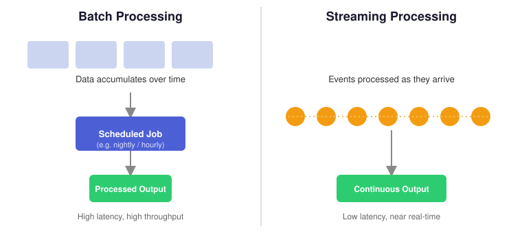
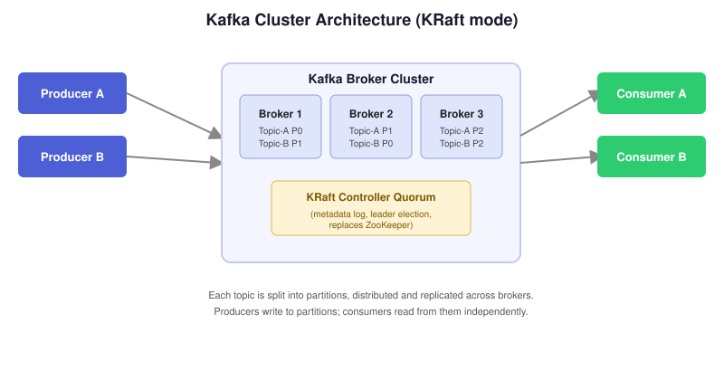
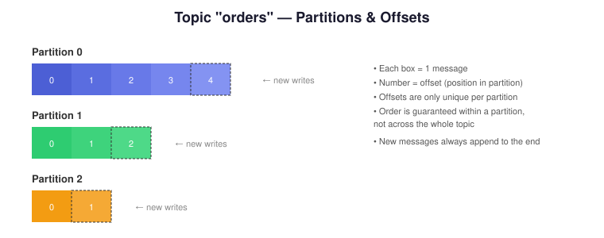
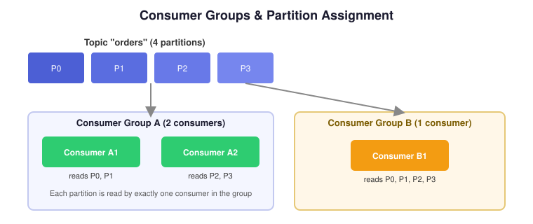

# Apache Kafka — Zero to Production 🚀

A complete, hands-on Kafka learning path — from core event-driven concepts to running Kafka in real data engineering pipelines. This repo follows the video series on YouTube.

📺 **Follow along:** [YouTube — @Data_with_Jay](https://www.youtube.com/@Data_with_Jay)

> Each phase below builds on the last. Don't skip Phase 0 — understanding *why* Kafka exists matters more than memorizing commands.

---

## 📑 Table of Contents

- [Phase 0 — Foundations](#phase-0--foundations-before-touching-kafka)
  - [0.1 Event-Driven Architecture (EDA)](#01-event-driven-architecture-eda)
  - [0.2 Streaming vs Batch Processing](#02-streaming-vs-batch-processing)
- [Phase 1 — Installation (Docker + KRaft)](#phase-1--installation-docker--kraft)
  - [1.1 Why Docker for Kafka?](#11-why-docker-for-kafka)
  - [1.2 Why KRaft and not ZooKeeper?](#12-why-kraft-and-not-zookeeper)
  - [1.3 Kafka Installation with Docker + KRaft](#13-kafka-installation-with-docker--kraft)
- [Phase 2 — Kafka Core Concepts (No Install Yet)](#phase-2--kafka-core-concepts-no-install-yet)
  - [2.1 What is Apache Kafka?](#21-what-is-apache-kafka)
  - [2.2 Kafka vs Traditional Message Queues](#22-kafka-vs-traditional-message-queues)
  - [2.3 Topics](#23-topics)
  - [2.4 Partitions](#24-partitions)
  - [2.5 Offsets](#25-offsets)
  - [2.6 Producers](#26-producers)
  - [2.7 Consumers](#27-consumers)
  - [2.8 Consumer Groups](#28-consumer-groups)
  - [2.9 Internal Components](#29-internal-components)
- [Phase 3 — Working with Kafka (Core)](#phase-3--working-with-kafka-core)
  - [3.1 Kafka CLI Tools](#31-kafka-cli-tools)
  - [3.2 Message Keys](#32-message-keys)
  - [3.3 Serialization](#33-serialization)
- [Phase 4 — Reliability & Guarantees](#phase-4--reliability--guarantees)
  - [4.1 Consumer Commits](#41-consumer-commits)
  - [4.2 Idempotent Producers](#42-idempotent-producers)
  - [4.3 Delivery Semantics](#43-delivery-semantics)
- [Phase 5 — Advanced Kafka](#phase-5--advanced-kafka)
  - [5.1 Retention Policies](#51-retention-policies)
  - [5.2 Log Compaction](#52-log-compaction)
  - [5.3 Kafka Streams (Intro)](#53-kafka-streams-intro)
  - [5.4 Kafka Connect](#54-kafka-connect)
- [Phase 6 — Operations & Production](#phase-6--operations--production)
  - [6.1 Scaling Kafka](#61-scaling-kafka)
  - [6.2 Monitoring & Lag](#62-monitoring--lag)
  - [6.3 Kafka in Real Data Engineering Pipelines](#63-kafka-in-real-data-engineering-pipelines)

---

## PHASE 0 — FOUNDATIONS (Before touching Kafka)

### 0.1 Event-Driven Architecture (EDA)

**Definition:** Event-Driven Architecture is a software design pattern where system components communicate by producing and reacting to **events** — immutable facts that "something happened" (e.g. `OrderPlaced`, `PaymentReceived`, `UserSignedUp`) — instead of calling each other directly.

In a traditional request/response system, Service A calls Service B directly and waits for a response. This tightly couples the two services: if B is slow or down, A suffers too.

In EDA:
- Producers emit events without knowing who (if anyone) is listening.
- Consumers subscribe to the events they care about and react independently.
- Services are decoupled in time, space, and synchronization.

**Why it matters for Kafka:** Kafka is the backbone that most modern EDA systems are built on — it acts as the durable, ordered log that events flow through between producers and consumers.

| Traditional (Request/Response) | Event-Driven |
|---|---|
| Tight coupling between services | Loose coupling via events |
| Synchronous, blocking calls | Asynchronous, non-blocking |
| Hard to add new consumers | New consumers can subscribe anytime |
| Failure in one service can cascade | Failures are isolated |

### 0.2 Streaming vs Batch Processing

**Definition:** *Batch processing* collects data over a period of time and processes it all at once (e.g. a nightly ETL job). *Stream processing* processes data continuously, record by record (or in small micro-batches), as it arrives.



| | Batch | Streaming |
|---|---|---|
| Latency | Minutes to hours | Milliseconds to seconds |
| Data volume per run | Large | Small, continuous |
| Typical tools | Spark (batch), Airflow, Hive | Kafka, Kafka Streams, Flink |
| Use case | End-of-day reports, data warehousing | Fraud detection, real-time dashboards |

Kafka sits at the center of streaming architectures because it can durably buffer high-throughput event streams while multiple downstream systems consume them independently — and at different speeds.

---

## PHASE 1 — INSTALLATION (DOCKER + KRAFT)

### 1.1 Why Docker for Kafka?

Kafka has traditionally been notoriously fiddly to install locally — JVM versions, ZooKeeper coordination, and config files that need to agree with each other. Docker solves this by packaging Kafka (and its dependencies) into a container that runs identically on any machine.

Benefits:
- **Reproducibility** — the same `docker-compose.yml` gives everyone on the team an identical cluster.
- **Isolation** — no polluting your host machine with Java versions and config files.
- **Disposability** — tear the whole cluster down and rebuild it in seconds with `docker compose down -v && docker compose up -d`.
- **Easy multi-broker setups** — simulate a real cluster (3+ brokers) on a single laptop.

### 1.2 Why KRaft and not ZooKeeper?

**Definition — KRaft (Kafka Raft):** KRaft is Kafka's built-in consensus protocol (based on Raft) that lets Kafka manage its own cluster metadata (broker membership, partition leadership, configs) **without depending on Apache ZooKeeper**.

Historically, every Kafka cluster required a separate ZooKeeper ensemble to track metadata and elect controllers. As of Kafka 3.x+, **KRaft is the default and recommended mode**, and ZooKeeper support has been removed in the newest Kafka versions.

Why KRaft is better:
- **One less system to deploy, secure, and monitor** — no separate ZooKeeper cluster.
- **Faster controller failover** and higher partition-count scalability.
- **Simpler mental model** — Kafka brokers themselves (acting as controllers) manage metadata via a Raft-replicated log.

### 1.3 Kafka Installation with Docker + KRaft

Below is a minimal single-broker KRaft-mode `docker-compose.yml` you can use to spin up a local Kafka cluster (using the `apache/kafka` image, which ships with KRaft built in — no ZooKeeper needed):

```yaml
# docker-compose.yml
services:
  kafka:
    image: apache/kafka:latest
    container_name: kafka
    ports:
      - "9092:9092"
    environment:
      KAFKA_NODE_ID: 1
      KAFKA_PROCESS_ROLES: broker,controller
      KAFKA_LISTENERS: PLAINTEXT://:9092,CONTROLLER://:9093
      KAFKA_ADVERTISED_LISTENERS: PLAINTEXT://localhost:9092
      KAFKA_CONTROLLER_LISTENER_NAMES: CONTROLLER
      KAFKA_CONTROLLER_QUORUM_VOTERS: 1@kafka:9093
      KAFKA_LISTENER_SECURITY_PROTOCOL_MAP: CONTROLLER:PLAINTEXT,PLAINTEXT:PLAINTEXT
      KAFKA_OFFSETS_TOPIC_REPLICATION_FACTOR: 1
      KAFKA_GROUP_INITIAL_REBALANCE_DELAY_MS: 0
```

Bring it up:

```bash
docker compose up -d
docker compose logs -f kafka
```

Verify the broker is alive by listing topics (should return empty on first run):

```bash
docker exec -it kafka /opt/kafka/bin/kafka-topics.sh \
  --bootstrap-server localhost:9092 --list
```

> 💡 For a realistic multi-broker cluster, duplicate the `kafka` service 2–3 times with different `KAFKA_NODE_ID` values and add each node to `KAFKA_CONTROLLER_QUORUM_VOTERS`. This is covered in [Phase 6.1 — Scaling Kafka](#61-scaling-kafka).

---

## PHASE 2 — KAFKA CORE CONCEPTS (NO INSTALL YET)

### 2.1 What is Apache Kafka?

**Definition:** Apache Kafka is a **distributed, durable, publish-subscribe event streaming platform**. It stores streams of records (events) in a fault-tolerant, ordered, append-only log, and lets multiple applications read and write to that log independently, at their own pace.

At its core, Kafka does three things really well:
1. **Publish and subscribe** to streams of records, similar to a message queue.
2. **Store** streams of records durably and reliably, for as long as you configure.
3. **Process** streams of records as they occur (via Kafka Streams / ksqlDB).



### 2.2 Kafka vs Traditional Message Queues

| | Traditional MQ (e.g. RabbitMQ) | Apache Kafka |
|---|---|---|
| Message retention | Deleted after consumption (typically) | Retained for a configurable period, regardless of consumption |
| Multiple consumers | Usually one consumer per message | Many consumer groups can independently re-read the same data |
| Ordering | Per-queue, message-by-message | Guaranteed per-partition |
| Throughput | Moderate | Very high (millions of msgs/sec) |
| Replay | Not typically supported | Native — just reset the consumer offset |
| Model | Smart broker, dumb consumer | Dumb broker, smart consumer (consumer tracks its own position) |

Kafka isn't a drop-in replacement for every message queue use case (e.g. it doesn't have per-message priority or complex routing like RabbitMQ), but it dominates for high-throughput, replayable event streaming.

### 2.3 Topics

**Definition:** A **topic** is a named, logical channel to which records are published. Think of it as a table in a database, or a folder of related events — e.g. `orders`, `payments`, `user-clicks`.

- Topics are **multi-producer** and **multi-consumer** — many apps can write to and read from the same topic.
- Topics are split into **partitions** for parallelism and scalability (see 2.4).
- Kafka does **not** enforce a schema on a topic by default — that's typically handled by a Schema Registry alongside serialization (see 3.3).

### 2.4 Partitions

**Definition:** A **partition** is an ordered, immutable, append-only sequence of records — the actual unit of storage and parallelism in Kafka. Every topic is split into one or more partitions, and each partition can live on a different broker.



Key properties:
- Order is guaranteed **within** a partition, never across the whole topic.
- More partitions = more parallelism (more consumers can read simultaneously) but also more overhead (open file handles, replication traffic, rebalance time).
- Partitions are replicated across brokers for fault tolerance (controlled by the topic's **replication factor**).

### 2.5 Offsets

**Definition:** An **offset** is a monotonically increasing integer that uniquely identifies the position of a record **within a partition**. Offsets are assigned by the broker as records arrive and never change.

- Offset `0` is the first record ever written to that partition.
- Consumers track "how far" they've read by remembering the **last committed offset** per partition (see [4.1 Consumer Commits](#41-consumer-commits)).
- Because offsets are stored, consumers can rewind and **replay** history — a core Kafka superpower traditional queues don't offer.

### 2.6 Producers

**Definition:** A **producer** is a client application that publishes (writes) records to one or more Kafka topics.

- The producer decides which **partition** a record goes to — either explicitly, via a round-robin/sticky default, or (most commonly) by hashing the record's **key** (see [3.2 Message Keys](#32-message-keys)).
- Producers can be tuned for throughput (batching, compression) or durability (`acks` setting — see [4.3 Delivery Semantics](#43-delivery-semantics)).

Minimal Python producer example (using `confluent-kafka`):

```python
from confluent_kafka import Producer

producer = Producer({"bootstrap.servers": "localhost:9092"})

producer.produce("orders", key="order-123", value="Order placed: 2x Laptop")
producer.flush()
```

### 2.7 Consumers

**Definition:** A **consumer** is a client application that subscribes to one or more topics and reads (pulls) records from them, tracking its own position via offsets.

- Kafka consumers **pull** data (unlike many MQ systems that push), giving consumers full control over their read rate.
- A single consumer can read from multiple partitions; a single partition, however, is only ever read by **one** consumer within a given consumer group at a time.

Minimal Python consumer example:

```python
from confluent_kafka import Consumer

consumer = Consumer({
    "bootstrap.servers": "localhost:9092",
    "group.id": "orders-service",
    "auto.offset.reset": "earliest",
})
consumer.subscribe(["orders"])

while True:
    msg = consumer.poll(1.0)
    if msg is None:
        continue
    if msg.error():
        print(f"Error: {msg.error()}")
        continue
    print(f"Received: {msg.value().decode('utf-8')}")
```

### 2.8 Consumer Groups

**Definition:** A **consumer group** is a set of consumers that cooperate to consume a topic — Kafka automatically distributes the topic's partitions across the group's members, so each partition is consumed by exactly one consumer in that group at a time.



- Different consumer groups are fully independent — each group has its own view of "how far" it has read.
- This is how Kafka supports **multiple independent applications** reading the same topic without interfering with each other (e.g. a fraud-detection service and an analytics service both reading the same `payments` topic).
- If a consumer in a group crashes, Kafka triggers a **rebalance** and reassigns its partitions to the remaining members.

### 2.9 Internal Components

A quick map of the moving parts inside a Kafka cluster:

- **Broker** — a single Kafka server; stores partitions and serves producer/consumer requests. A cluster is made up of multiple brokers.
- **Controller** — the broker (or, in KRaft, the controller quorum) responsible for cluster-wide metadata: partition leadership, broker membership, config changes.
- **Leader / Follower replicas** — each partition has one leader replica (handles all reads/writes) and zero or more follower replicas (replicate data for fault tolerance).
- **In-Sync Replicas (ISR)** — the set of replicas fully caught up with the leader; only ISR members are eligible to become the new leader if the current one fails.
- **Log segment** — partitions are physically stored on disk as a series of append-only segment files, which is what makes retention/compaction efficient.

---

## PHASE 3 — WORKING WITH KAFKA (CORE)

### 3.1 Kafka CLI Tools

Kafka ships with a set of shell scripts for day-to-day operations — invaluable for debugging and learning before you touch client code.

```bash
# Create a topic
kafka-topics.sh --bootstrap-server localhost:9092 \
  --create --topic orders --partitions 3 --replication-factor 1

# List topics
kafka-topics.sh --bootstrap-server localhost:9092 --list

# Describe a topic (partitions, leaders, ISR)
kafka-topics.sh --bootstrap-server localhost:9092 \
  --describe --topic orders

# Produce messages interactively
kafka-console-producer.sh --bootstrap-server localhost:9092 --topic orders

# Consume messages from the beginning
kafka-console-consumer.sh --bootstrap-server localhost:9092 \
  --topic orders --from-beginning

# Inspect consumer group lag
kafka-consumer-groups.sh --bootstrap-server localhost:9092 \
  --describe --group orders-service
```

### 3.2 Message Keys

**Definition:** The **key** is an optional field attached to every Kafka record, used by the producer's default partitioner to decide which partition the record lands in (`hash(key) % num_partitions`). Records with the same key always land on the same partition.

- **Use a key when order matters** for a related set of events — e.g. keying by `customer_id` guarantees all of one customer's events are processed in order.
- **Leave the key null** when you don't care about ordering and just want even load distribution (Kafka uses a sticky round-robin strategy in that case).
- Keys are also essential for **log compaction** (see [5.2](#52-log-compaction)), which retains only the latest record per key.

### 3.3 Serialization

**Definition:** **Serialization** is the process of converting an in-memory object (a Python dict, a Java POJO) into bytes for transport over the network, and **deserialization** is the reverse on the consumer side. Kafka stores and transports raw bytes — it has no built-in understanding of your data's structure.

Common formats:

| Format | Human-readable | Schema enforcement | Size |
|---|---|---|---|
| JSON | ✅ | ❌ (unless paired with JSON Schema) | Larger |
| Avro | ❌ | ✅ (via Schema Registry) | Compact |
| Protobuf | ❌ | ✅ | Compact |

For production systems, **Avro or Protobuf with a Schema Registry** is strongly preferred — it prevents producers from silently breaking consumers by changing the record's shape.

---

## PHASE 4 — RELIABILITY & GUARANTEES

### 4.1 Consumer Commits

**Definition:** A **commit** is when a consumer tells Kafka "I have successfully processed up to this offset." Kafka stores committed offsets in an internal topic called `__consumer_offsets`, so that if the consumer restarts, it resumes from where it left off instead of from the beginning.

Two main strategies:
- **Auto-commit** (`enable.auto.commit=true`) — offsets are committed periodically in the background. Simple, but risks reprocessing or skipping messages if a crash happens mid-batch.
- **Manual commit** (`enable.auto.commit=false`) — the application explicitly calls `commit()` after successfully processing a record/batch, giving precise control over "at-least-once" vs "at-most-once" behavior.

### 4.2 Idempotent Producers

**Definition:** An **idempotent producer** guarantees that retries caused by transient network errors don't result in duplicate messages — Kafka assigns each producer a unique ID and sequence number per partition, and deduplicates on the broker side.

- Enabled with `enable.idempotence=true` (default in modern Kafka clients).
- Solves the classic problem: producer sends a message → network blip → broker never acks → producer retries → without idempotence, the message could be **written twice**.
- Idempotence guarantees **exactly-once delivery to a single partition**, per producer session — it's the foundation for Kafka's broader "exactly-once semantics" (EOS) when combined with transactions.

### 4.3 Delivery Semantics

**Definition:** Delivery semantics describe the guarantee a system provides about how many times a message may be processed.

| Semantic | Guarantee | Risk |
|---|---|---|
| **At-most-once** | Message delivered 0 or 1 times | Possible data loss |
| **At-least-once** | Message delivered 1 or more times | Possible duplicates |
| **Exactly-once** | Message delivered and processed exactly 1 time | Hardest to achieve; needs idempotent producers + transactional consumers |

Where this is configured on the producer side, via the **`acks`** setting:
- `acks=0` — fire and forget (fastest, least safe).
- `acks=1` — wait for the partition leader to acknowledge (default balance).
- `acks=all` (`-1`) — wait for all in-sync replicas to acknowledge (safest, slowest).

---

## PHASE 5 — ADVANCED KAFKA

### 5.1 Retention Policies

**Definition:** **Retention** controls how long Kafka keeps records in a partition before deleting them, regardless of whether they've been consumed.

Configured per topic via:
```bash
kafka-configs.sh --bootstrap-server localhost:9092 \
  --alter --entity-type topics --entity-name orders \
  --add-config retention.ms=604800000   # 7 days
```

Retention can be based on:
- **Time** (`retention.ms`) — delete segments older than N milliseconds.
- **Size** (`retention.bytes`) — delete oldest segments once the partition exceeds N bytes.

### 5.2 Log Compaction

**Definition:** **Log compaction** is an alternative retention strategy that, instead of deleting old records after a time/size limit, retains **only the latest record for each key**, deleting older records with the same key. It effectively turns a Kafka topic into a compacted changelog — useful for representing "current state" (e.g. `user-id → latest profile`).

- Enabled per topic with `cleanup.policy=compact`.
- Powers Kafka's own `__consumer_offsets` internal topic, and is the foundation for Kafka Streams' **state stores** and **KTables**.
- Records with a `null` value act as **tombstones** — a signal to eventually remove that key entirely.

### 5.3 Kafka Streams (Intro)

**Definition:** **Kafka Streams** is a Java client library (part of Apache Kafka) for building stream-processing applications directly on top of Kafka topics — no separate cluster required, unlike Spark or Flink.

Core abstractions:
- **KStream** — a stream of independent, unbounded records (like an event log).
- **KTable** — a changelog view of a stream, representing the latest value per key (like a table).
- Supports stateless transforms (`map`, `filter`) and stateful operations (`groupBy`, `aggregate`, `join`) with exactly-once processing guarantees.

```java
StreamsBuilder builder = new StreamsBuilder();
KStream<String, String> orders = builder.stream("orders");

orders.filter((key, value) -> value.contains("Laptop"))
      .to("laptop-orders");
```

### 5.4 Kafka Connect

**Definition:** **Kafka Connect** is a framework for reliably streaming data **between Kafka and external systems** (databases, S3, Elasticsearch, etc.) using pre-built, configuration-driven connectors — without writing custom producer/consumer code.

- **Source connectors** pull data *into* Kafka (e.g. `debezium` for database CDC).
- **Sink connectors** push data *out of* Kafka (e.g. into a data warehouse like Snowflake or BigQuery).
- Runs as its own cluster of "workers," and is typically how Kafka integrates into a broader data platform.

---

## PHASE 6 — OPERATIONS & PRODUCTION

### 6.1 Scaling Kafka

Ways to scale a Kafka cluster:
- **Add brokers** — spreads partition storage/throughput across more machines.
- **Increase partitions** — increases consumer parallelism (note: partitions can only be *increased*, never decreased, on an existing topic).
- **Increase replication factor** — improves fault tolerance at the cost of extra storage/network overhead.
- **Tune producer batching** (`linger.ms`, `batch.size`) and **compression** (`compression.type=lz4/zstd`) to increase throughput per broker.

Rule of thumb: partition count should be driven by your target consumer parallelism, not set arbitrarily high — more partitions means longer rebalances and more open file handles per broker.

### 6.2 Monitoring & Lag

**Definition:** **Consumer lag** is the difference between the latest offset written to a partition and the last offset a consumer group has committed — it tells you how "behind" a consumer group is.

```bash
kafka-consumer-groups.sh --bootstrap-server localhost:9092 \
  --describe --group orders-service
```

Key things to monitor in production:
- **Consumer lag** (per partition and aggregated) — the #1 signal that a consumer can't keep up.
- **Under-replicated partitions** — indicates broker or network trouble.
- **Request/response latency** on brokers.
- **Disk usage** per broker, since Kafka is disk-bound by nature.

Common tooling: Prometheus + Grafana (via the JMX exporter), Confluent Control Center, Burrow, or Kafka's own `kafka-consumer-groups.sh`.

### 6.3 Kafka in Real Data Engineering Pipelines

A typical production pattern for Kafka in a modern data platform:

```
Source Systems (DBs, APIs, apps)
        │  (Kafka Connect source connectors / app producers)
        ▼
   Kafka Cluster (raw events, topic per entity)
        │
        ├──► Kafka Streams / ksqlDB  →  real-time enrichment, alerts
        │
        └──► Kafka Connect sink connectors
                     │
                     ▼
        Data Warehouse / Lakehouse (Snowflake, BigQuery, S3 + Iceberg)
                     │
                     ▼
              BI dashboards, ML features
```

Kafka typically sits at the **ingestion and decoupling layer** — every downstream system (warehouse, real-time alerting, ML feature pipelines) reads from the same durable event log independently, at its own pace, without putting load on the original source systems.

---

## 🙌 Credits

This tutorial series and repo are maintained as a companion to the YouTube channel:

📺 **[@Data_with_Jay](https://www.youtube.com/@Data_with_Jay)**

If this helped you, consider giving the repo a ⭐ and subscribing to the channel for the video walkthroughs of every phase above.
